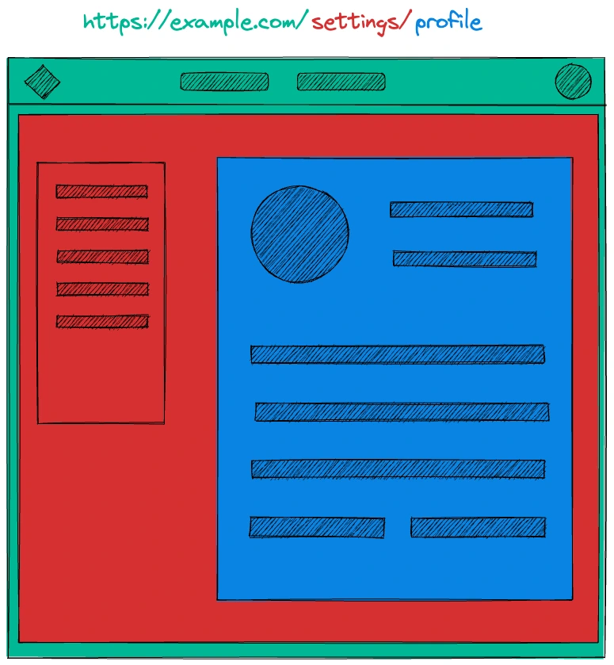
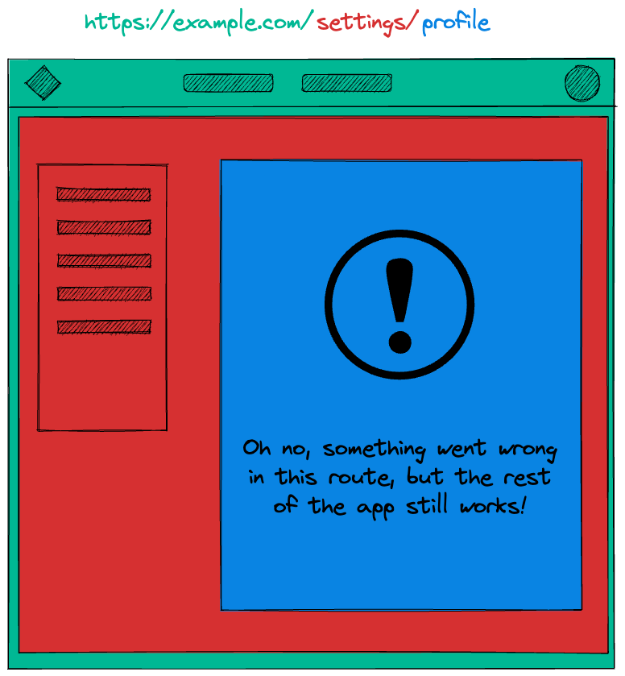

> Remix is a JavaScript full stack web framework that lets you focus on the user interface and work back through web standards to deliver a fast, slick, and resilient user experience.

I've been using Remix since I joined [Bobsled](https://www.bobsled.co/) a year ago, meaning that I am using it on a daily basis and not only for side projects.

Remix is a full-stack framework used to deliver web applications that work and leverage Web APIs to improve the user experience by making them reliable and more capable.

Being a Software Engineer with a strong focus on the frontend, I must admit it's the full-stack framework of my dreams.

I remember the first time I tried it out, I was shocked by how easy it was to write both **backend and frontend code in the same file**.

Therefore, repeated back and forth between frontend developers and backend developers is no longer an issue. Frontend developers can decide what data they want the server to return, and handle data mismatching server-side.

Not only that, but Remix also makes it easy to **create new routes**, **handle errors**, **mutate data**, and many other things.

In this article, I will cover what Remix offers from a high-level perspective.

## Routing

Routing is one of the most important concepts in Remix, but not necessarily the most difficult to understand.

Internally, it uses [React Router](https://github.com/remix-run/react-router) with all its beauties and has a file-based routing system for its routes.

A route is automatically associated with any file that is created within the specific `app/routes/` folder. Below is an example of how it would look for a settings page.

```plaintext
📦app
┣ 📂routes
┃ ┣ 📂settings
┃ ┃ ┗ 📄index.tsx
┃ ┃ ┗ 📄profile.tsx
┃ ┃ ┗ 📄account.tsx
┃ ┃ ┗ 📄appearance.tsx
┃ ┃ ┗ 📄notifications.tsx
┃ ┗ 📄index.tsx
┗ 📄root.tsx
```

Which translates into:

- `routes/index.tsx` → `/`
- `routes/settings/index.tsx` → `/settings`
- `routes/settings/profile.tsx` → `/settings/profile`
- `routes/settings/account.tsx` → `/settings/account`
- `routes/settings/appearance.tsx` → `/settings/appearance`
- `routes/settings/notifications.tsx` → `/settings/notifications`

## Nested routes

With Remix, we can have **nested routes** thanks to its `<Outlet />` component, which allows a component to nest and render a matched child route within it.

Each segment of the URL represents a route that defines:

- The layouts to render on the page
- The code split JavaScript bundles to load
- The data dependencies of those layouts

Let's consider the example below to help us figure out how it would work with nested routes.



As the user clicks between the links in the sidebar, **only the blue content changes and the rest persists**.

Another handy feature of nested routes is error handling. **When an error occurs, only the associated route is affected and the rest of the app still works**.



## Data loading

### Server-side

Each route can export a component and a `loader` function to load data server-side at runtime.

The `useLoaderData` hook is used to get data from the loader into the component server-side.

```typescript
import type { LoaderFunction } from '@remix-run/node';

export const loader: LoaderFunction = async ({ params }) => {
  const article = await db.articles.findOne({
    where: { id: params.articleId },
  });

  return json({
    article,
  });
};

export default function ArticleRoute() {
  const { article } = useLoaderData();
  return (
    <article>
      <h1>{article.title}</h1>
      <p>{article.content}</p>
    </article>
  );
}
```

You can even `throw` a `Response` in the loader which will be caught by the `CatchBoundary` component. I will cover the `CatchBoundary` component later in this article.

```typescript
import type { LoaderFunction } from '@remix-run/node';

export const loader: LoaderFunction = async ({ params }) => {
  const article = await db.articles.findOne({
    where: { id: params.articleId },
  });

  if (!article) {
    // we know we can't render the component
    // so throw immediately to stop executing code
    // and show the not found page
    throw new Response('Not Found', { status: 404 });
  }

  return json({
    article,
  });
};
```

### Route Params

When you name a file with `$` at the beginning, like `routes/blog/$articleId.tsx`, this will create a new dynamic route and the dynamic segment (the one starting with `$`) value will be passed to the `loader` function as an argument.

```typescript
// routes/blog/$articleId.tsx
import type { LoaderFunction } from '@remix-run/node';

export const loader: LoaderFunction = async ({ params }) => {
  console.log(params.articleId);
};
```

Given the following URL `/blog/1234`, the `params.articleId` value would be `1234`.

### Client-side

Remix does a fantastic job when it comes to data conventions and nested routes. It's most likely, you won't need client-side data libraries like React Query, SWR, Apollo etc.

However, you can still fetch data client-side thanks to their `useFetcher` hook which is capable of doing several things like:

- Fetch data not associated with UI routes.
- Submit data to actions without navigating.
- Handle multiple concurrent submissions in a list.

```typescript
import { useFetcher } from '@remix-run/react';

function SomeComponent({ article }) {
  const fetcher = useFetcher();

  const fetchCloudData = useCallback(
    () => fetcher.load(`/blog/${article.id}/`),
    [fetcher, article.id],
  );

  // ...
}
```

## Data Mutations

Remix leverages two web APIs to perform data mutations: `<form>` and HTTP.  
When the user submits a form, Remix will:

1. Call the action for the form.
2. Reload all of the data for all of the routes on the page.

You need to export an action function from the route file which will handle any POST form submission, whereas the loader will handle any GET form submission.

Remix offers a built-in `<Form>` component which is an enhanced HTML form component that gives you access to the pending form state to build a nicer user experience.  
If JavaScript is not enabled, it will fall back to the native HTML form component and still work.

Another thing to call out is that Remix will handle race conditions from resubmissions for you.

```typescript
import type { ActionArgs } from '@remix-run/node';
import { redirect } from '@remix-run/node';
import { Form } from '@remix-run/react';

export default function NewArticle() {
  return (
    <Form method="post" action="/articles/new">
      <p>
        <label>
          Title: <input name="title" type="text" />
        </label>
      </p>
      <p>
        <label>
          Content:
          <br />
          <textarea name="content" />
        </label>
      </p>
      <p>
        <button type="submit">Create</button>
      </p>
    </Form>
  );
}

// Note the "action" export name, this will handle our form POST
export const action = async ({ request }: ActionArgs) => {
  const formData = await request.formData();
  const article = await createArticle(formData);
  return redirect(`/articles/${article.id}`);
};
```

## Resource Routes

You may need to have some routes that don't send HTML, but return another type of data instead. In Remix, they are called _Resource Routes_ and can send any kind of _Response_.

It's easy to create them, you just don't need to export the UI component from your routes. If you call a Resource Route with `GET`, the loader's response is returned, if you call it with `POST`, the action's response is called.

## Error Handling

**Remix automatically catches most errors in your code**, on the server or in the browser, and renders the closest `ErrorBoundary` component to where the error occurred.

All you need to do is export the `ErrorBoundary` component from the route module, and it will handle any error on that specific route.

```typescript
export function ErrorBoundary({ error }) {
  return (
    <div>
      <h1>Error</h1>
      <p>{error.message}</p>
    </div>
  );
}
```

**If a route is nested, the error will be handled on that route and the parent route will continue to work.**

When no `ErrorBoundary` component is defined, Remix will render the closest `ErrorBoundary` component to where the error occurred.

## Optimistic UI

Remix makes it very easy to create optimistic UI with their `useNavigation` and `useFetcher` hooks.

To develop an optimistic UI, you can use the following strategy:

1. When a user submits a form, retrieve the data from either `navigation.formData` or `fetcher.submission`.
2. Utilize `submission.formData` to render an optimistic version of what it will be rendered when the submission completes successfully.
3. Remix automatically revalidates all the data.
   - If successful, the user won't even notice.
   - If it fails, the page data will automatically sync with the server, and the UI will revert to its previous state. Additionally, the app will notify the user of any issues, which will likely be automatic in Remix with error boundaries.

## Conclusion

In this article, I have covered only the fundamentals of Remix. It has many other capabilities that I could talk about, but an article wouldn't be enough.

You may wonder why you should pick Remix as your next framework instead of just going with a simple Create React App.

On one hand, React on its own is very flexible and lets you build your application in your preferred way. On the other hand, given its flexibility, you may end up reinventing the wheel and rolling your own application structure and design patterns.

Remix is a framework. It has predefined project structures and conventions, which makes it easier for developers to navigate and understand the codebase. This can also **help new team members with their onboarding process** and **enhance the overall quality of the code**.

When you use a framework, **you can focus on developing your app and its features**, you don't need to worry about the underlying infrastructure.

Remix is relatively new, it has been around for 2 years but already gained significant traction. Recently, Shopify acquired it. This acquisition is a big achievement for the Remix team, as Shopify's investment is expected to accelerate its development and provide long-term support.

Give Remix a shot, and you won't regret it.
